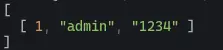

# Bun-Sqlite

If you are not familiar with bun it's a super fast compilar that hase many features built-in like sqlite.

you can install it with this command

> curl -fsSL https://bun.sh/install | bash

you can also vist the website [Here](https://bun.sh/).

So let's see how sqlite works.

```js
import { Database } from "bun:sqlite";

const db = new Database("base.db", { create: true });
```

it allows you to Connect to your sqlite database and if the database file doesn't exist, the **_Database_** function will create the file.

But we are not done yet, we can also create tables with the help of query's and run them.

here is an example

```js
let query = db.query(
  `create table foo(id int primary key,username varchar(225),passwd varchar(225));`
);
query.run();
```

we can use that same functions with inserting data into tables.

```js
query = db.query(`insert into foo values(1,'admin','1234');`);
query.run();
```

we can also fetch data from select statement.

```js
query = db.query(`select * from foo`);
console.log(query.values());
```

finally when it's time to close the database, it can be done in one simple step.

```js
db.close();
```

bun.js really simplifies the process of using a database.

## Here is an output

Output of base.db


Output of select statement


